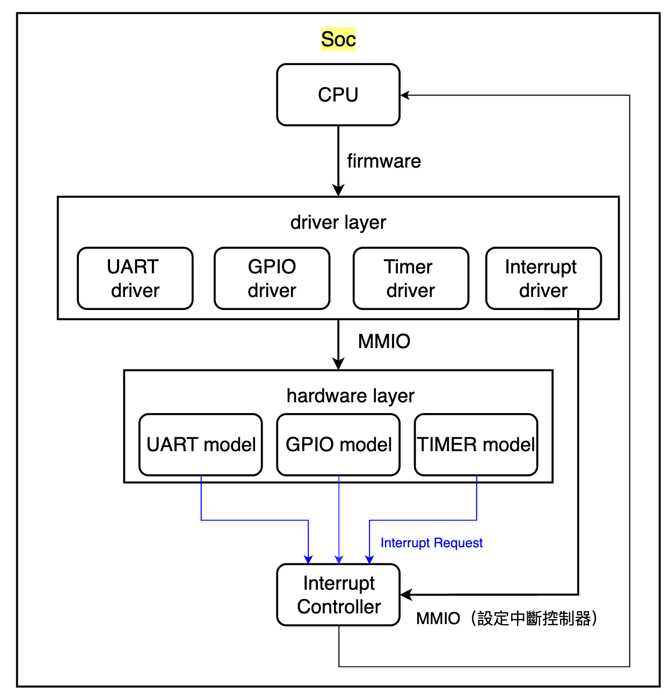

# Mini Soc Simulator
本專案使用 C 實作一個簡化的 Mini SoC / Virtual MCU 模擬環境，透過軟體模擬 CPU、Memory-Mapped I/O 以及 GPIO、UART、Timer 等 Peripheral 的基本行為。

專案主要將系統拆分為 Hardware Model、Driver、Firmware 與 Testbench，模擬 CPU 透過 MMIO 操作 Peripheral Register，以及 Peripheral 在事件發生時透過 Interrupt 通知 CPU 的基本流程。

目前實作的 Peripheral 包含：
- GPIO
- UART
- Timer

並支援基本的 MMIO Register Access 與 Interrupt Handling。

## 系統架構：


### 架構說明
#### Hardware Model
Hardware Model 負責模擬 SoC 中實際 Peripheral 的硬體行為，包括：

Register 狀態
Peripheral 狀態變化
Interrupt Status
外部輸入事件(Testbench)
Timer Counter

Firmware 不會直接修改 Hardware Model 的內部狀態，而是透過 MMIO / Driver 進行操作。

#### Memory-Mapped I/O (MMIO)
主要用來模擬 CPU 存取 Periphral Register

而每個 Peripheral 都具有自己的 Base Address 與 Register Offset，例如：

``` Peripheral Base Address + Register Offset => Register Address ```

CPU 就可以透過：
```
mmio_read(address);
mmio_write(address, value);
```
CPU 就可以透過：讀寫對應的 Hardware Register 

### Driver
Driver 位於 Firmware 與 Hardware 之間，負責封裝 MMIO Register 行為。

Firmware 不需要了解 Peripheral 的實作細節，而是透過 Driver 提供的介面操作硬體。

當 Firmware 需要操作某個 Hardware Block 時，通常會透過對應的 Driver 封裝該硬體的操作細節。

例如：Firmware 想將 GPIO Pin 0 設定成 HIGH。

### Firmware
Firmware 為執行於 CPU 上的軟體，它會模擬 CPU 執行的系統邏輯，主要負責定義 Embedded System 要怎麼運作：

- 初始化 GPIO / UART / Timer
- 設定 GPIO output
- 透過 UART 傳送資料
- 處理 UART command
- 設定 Timer
- 執行 application logic
- 執行 Interrupt Service Routine (ISR)

Firmware 若需要操作 Peripheral，不能直接修改 Peripheral 內部狀態，
而必須透過 Driver => MMIO => Peripheral Register 來完成操作。

### CPU
CPU 為 SoC 中負責執行 Firmware 的運算單元。
本 Simulator 透過 `cpu.c` 模擬 CPU 的基本執行行為，例如：
- 正常執行 Firmware
- 接收 Peripheral IRQ
- 發生 Interrupt 時切換至對應 ISR
- ISR 完成後恢復正常 Firmware 執行流程

CPU 本身不直接定義 GPIO、UART、Timer 的應用邏輯。

#### Testbench
為本模擬器用來模擬外部事件行為的，所謂外部事件即：Soc 之外的單元。

舉凡：GPIO 外接的 Button 觸發（即 GPIO_IN 狀態改變）、 Mock PC 欲透過 UART 傳送資料到 Soc 等...皆屬於外部設備之行為。於本專案中皆是透過此檔進行模擬。

外部事件不透過 CPU/MMIO，而是透過 Peripheral 提供的 external signal interface 直接影響 Peripheral hardware model；實際 Register state 的更新仍由 Peripheral hardware model 負責。

例如：
```
External UART Data => Testbench => UART Hardware
(可能是 PC 傳給 Soc UART)
```
或：
```
External GPIO Signal => Testbench => GPIO Hardware
(例如：Soc 上的 GPIO 所連接 Button 被觸發邏輯為 1 這種外部事件)
```
藉此將「外部事件」與 Firmware 分離，以更清楚的劃分個 layer 的行為。

### UART
負責模擬硬體 UART Serial Communication 傳輸事件，此處目前定義的結構為:
目前 UART Register Map 採用 32-bit register width，每個 Register 佔用 4 Bytes，
因此各 Register Offset 以 0x04 遞增，以維持一致的 register alignment。

雖然 UART TX/RX 實際有效資料目前僅使用低 8 bits，
UART_TX_DATA 與 UART_RX_DATA 仍以 uint32_t 表示，以維持整體 Register Map 的一致性。
```c
typedef struct {
    uint32_t UART_CTRL;
    uint32_t UART_STATUS;
    uint32_t UART_TX_DATA;
    uint32_t UART_RX_DATA;
    uint32_t UART_BAUD_RATE;
    uint32_t UART_INT_EN;
    uint32_t UART_INT_STATUS;
} UART_Registers;
```

- UART_CTRL
=> 此控制腳使用到 2 bit 做 TX、RX_EN 的致能腳，用來設定當前是否可傳輸或接收。

UART_STATUS
- `UART_STATUS_TX_READY`
  - `1`：UART TX 已準備好接受下一筆待傳送資料。
  - `0`：UART TX 尚未準備完成。

- `UART_STATUS_RX_READY`
  - `1`：UART RX_DATA 中存在尚未被 CPU 讀取的資料。
  - `0`：UART RX_DATA 目前沒有待 CPU 讀取的有效資料。

### Timer

Timer Module 模擬基本 Hardware Timer。

目前包含：

- Timer Enable / Disable
- Counter
- Compare Value
- Interrupt Enable
- Interrupt Status
- One-Shot Mode
- Auto-Reload Mode

Timer 啟動後，Counter 會隨 Simulation Tick 增加。

當 COUNT == COMPARE：

Timer 會設定 Interrupt Status，並在 Interrupt Enable 的情況下通知 CPU。

#### One-Shot Mode
Compare Match 後停止 Timer：
```
COUNT
0 -> 1 -> 2 -> 3 -> 4 -> 5 -> IRQ -> STOP
```
#### Auto-Reload Mode
Compare Match 後將 Counter Reset，會自動重新開始下一個週期：
```
0 -> 1 -> 2 -> 3 -> 4 -> 5 -> IRQ -> 0 -> 1 -> 2 -> 3 -> 4 -> 5 -> IRQ
                                    (新的一run)
```

### 專案檔案架構
```
mini-soc/
│
├── include/
│   ├── cpu.h
│   ├── firmware.h
│   ├── gpio.h
│   ├── gpio_driver.h
│   ├── timer.h
│   ├── timer_driver.h
│   ├── uart.h
│   ├── uart_driver.h
│   ├── mmio.h
│   └── soc_memory_map.h
│
├── src/
│   ├── cpu.c
│   ├── firmware.c
│   ├── gpio.c
│   ├── gpio_driver.c
│   ├── timer.c
│   ├── timer_driver.c
│   ├── uart.c
│   ├── uart_driver.c
│   ├── mmio.c
│   └── soc_memory_map.c
│
├── test/
│   └── testbench.c
│
├── main.c
├── Makefile
└── README.md
```

### 專案使用方式
新增、刪除檔案後，要記得去 Makefile 做更新，然後下：
```
make
```

然後跑執行檔：
```
./mini_soc
```